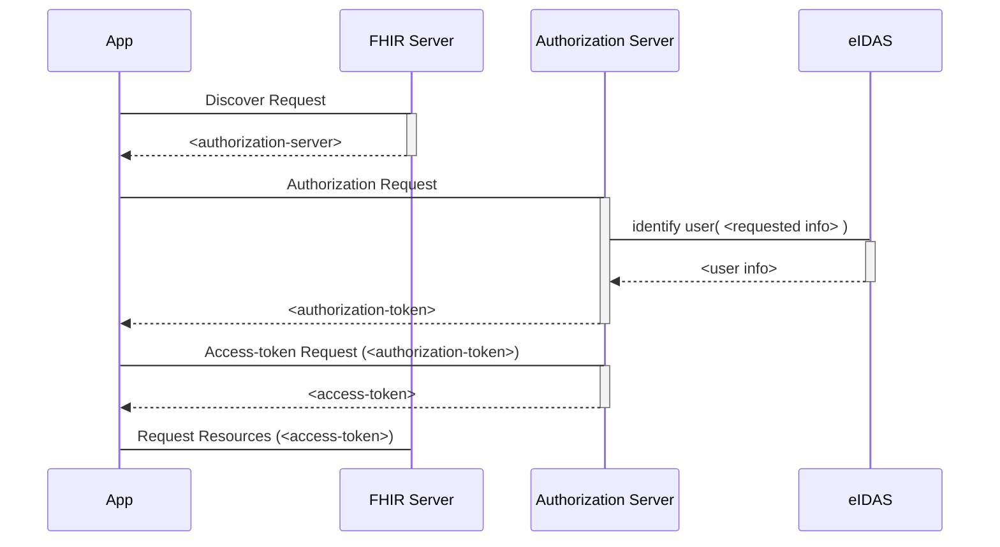
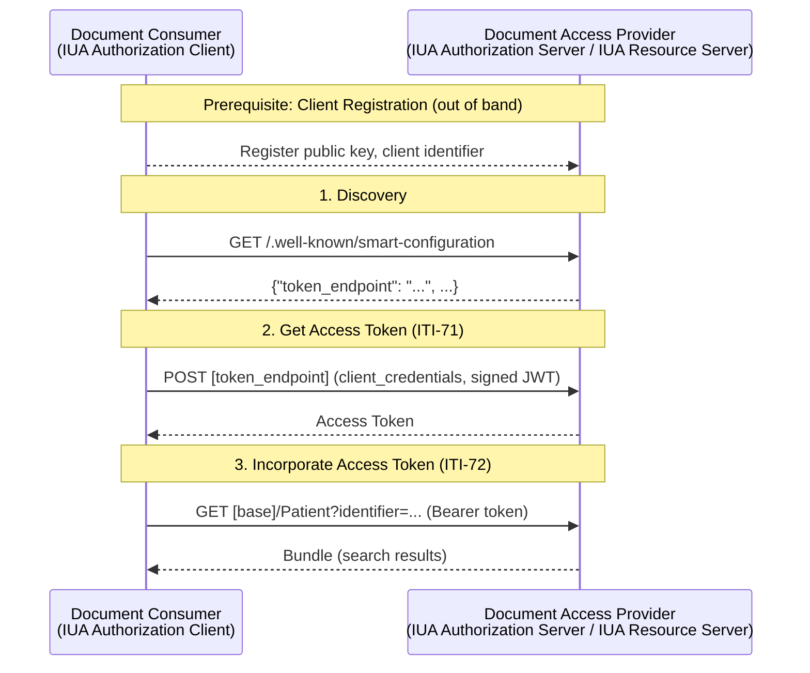
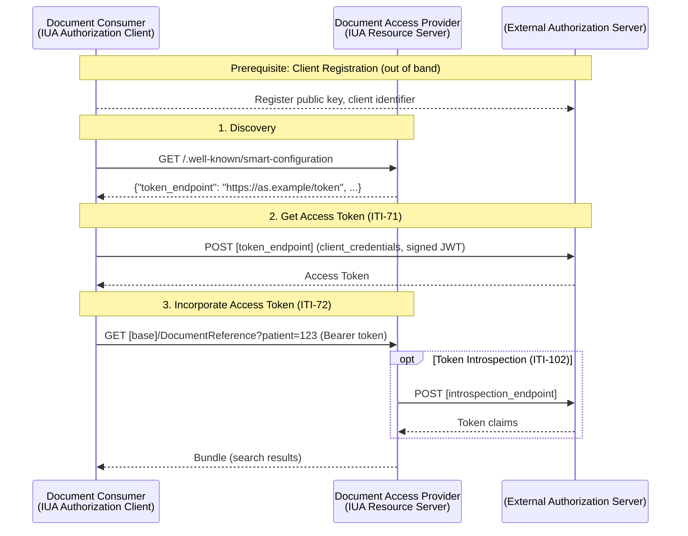

This page addresses the authorization and authentication related aspects of the IG.

### Overview

As indicated the in the [EHDS Interoperability Landscape](implementation.html), within the EHDS scope there are three types of connections:
* system-2-system
* Healthcare Professional access
  * Within a Healthcare Provider
  * With HPAS
* Patient access (HDAS)

### EHDS requirements

**Authentication:**

  * On HDAS: eIDAS-compliant electronic identification for Patients ([Art16](https://eur-lex.europa.eu/legal-content/EN/TXT/HTML/?uri=OJ:L_202500327#art_16).
  * On HPAS: eIDAS-compliant electronic identification Health professionals ([Art12](https://eur-lex.europa.eu/legal-content/EN/TXT/HTML/?uri=OJ:L_202500327#art_12)).

**Authorization:**

* Patient-controlled authorization ([Art4](https://eur-lex.europa.eu/legal-content/EN/TXT/HTML/?uri=OJ:L_202500327#art_4), [Art7](https://eur-lex.europa.eu/legal-content/EN/TXT/HTML/?uri=OJ:L_202500327#art_7), [Art8](https://eur-lex.europa.eu/legal-content/EN/TXT/HTML/?uri=OJ:L_202500327#art_8)), allowing the patient to
  * authorize other persons to access their data ([Art4](https://eur-lex.europa.eu/legal-content/EN/TXT/HTML/?uri=OJ:L_202500327#art_4))
  * authorize transfer of their data to other providers ([Art7](https://eur-lex.europa.eu/legal-content/EN/TXT/HTML/?uri=OJ:L_202500327#art_7))
  * restrict access to parts of their data ([Art8](https://eur-lex.europa.eu/legal-content/EN/TXT/HTML/?uri=OJ:L_202500327#art_8))
* Access must be provided to only the relevant and necessary data  ([Art11](https://eur-lex.europa.eu/legal-content/EN/TXT/HTML/?uri=OJ:L_202500327#art_11))
* Member states define which Healthcare Professional can access what data categories. 

**Secure Data Exchange:**

* Secure exchange of data using standard formats
* Standardised EHR exchange format ([Art15](https://eur-lex.europa.eu/legal-content/EN/TXT/HTML/?uri=OJ:L_202500327#art_15))
* MyHealth@EU infrastructure ([Art23](https://eur-lex.europa.eu/legal-content/EN/TXT/HTML/?uri=OJ:L_202500327#art_23))

## Approach taken in this IG

This IG adopts [FHIR SMART App Launch](https://hl7.org/fhir/smart-app-launch/app-launch.html) as the preferred choice for authorization, authentication and secure communication:

* Patient facing systems support the `Patient Access for Standalone Apps` or `Patient Access for EHR Launch` capabilities (see [SMART App Launch Capabilities](https://hl7.org/fhir/smart-app-launch/conformance.html)).
* Healthcare Professional facing systems support the `Clinician Access for Standalone Apps` or `Clinician Access for EHR Launch` capabilities (see [SMART App Launch Capabilities](https://hl7.org/fhir/smart-app-launch/conformance.html)).
* System-2-system interactions support [SMART Backend Services](https://hl7.org/fhir/smart-app-launch/backend-services.html) 

SMART App Launch is compatible with IHE-IUA and adds FHIR server access specific launch mechanisms and scope definitions.

The table below shows the requirements for supporting [FHIR SMART App Launch](https://hl7.org/fhir/smart-app-launch/app-launch.html).

<table class="grid">
  <thead>
    <tr><th>API</th>               <th>Backend</th><th>Patient Access</th><th>Clinician Access</th><th>EIDAS</th></tr>
  </thead>
  <tbody>
    <tr><td>Patient</td>    <td>-</td>      <td>R</td>             <td>O</td>               <td>R</td>    </tr>
    <tr><td>Healthcare Professional</td>         <td>-</td>      <td>-</td>             <td>R (eIDAS)</td>       <td>R</td>    </tr>
    <tr><td>Intra-country</td>     <td>R</td>      <td>-</td>             <td>O (eIDAS)</td>       <td>R</td>    </tr>
    <tr><td>Intra-Organization</td><td>R</td>      <td>-</td>             <td>O</td>               <td>R</td>    </tr>
    <tr><td>Wellness</td>          <td>-</td>      <td>-</td>             <td>R (eIDAS)</td>       <td>R</td>    </tr>
    <tr>      <td colspan="5">Where R stands for REQUIRED and O for OPTIONAL.</td>    </tr>
  </tbody>
</table>

When the table indicates (eIDAS), it means that authentication SHALL be based on eIDAS integration in OAuth2 as is specified by [eIDAS](https://eidas.ec.europa.eu/efda/home). A deployment MAY use another, additional, authorization schemes where its context requires it and allows it, when doing so, it SHALL declare that scheme in its CapabilityStatement. Absent such a declaration, the required SMART App Launch Capability presented in the table above is the expected default.

In the more infrastructure related environments, SMART Backend Services is required as the systems in these environments need to ensure that the correct data is aggregated at the specific points (e.g. in EHR System Gateways), which requires backend service communication that does not involve a user.

Where SMART App Launch is used, it is adopted as specified—including grant types, client authentication (`private_key_jwt`), and related JWT requirements. As a profile on SMART, all underlying SMART requirements still apply; omitting a detail from this IG does not exempt implementations from SMART requirements.

SMART Backend Services is itself a profile of [RFC 6749](https://www.rfc-editor.org/rfc/rfc6749) (`client_credentials` grant) and [RFC 8414](https://www.rfc-editor.org/rfc/rfc8414) (authorization-server metadata), packaged as a single testable mechanism—preferred over the bare RFCs for that reason. National trust frameworks that use coarser, regulatory-level scope groupings operate at the access-service layer; the EHR API enforces resource-level scopes.

> **Note:** This IG uses IHE IUA actor definitions grouped with the SMART Backend Services requirements. Where a deployment uses SMART and the two differ, SMART Backend Services is authoritative.

## Authorization and eIDAS

eIDAS is build on [OpenID for Verifiable Credential Issuance 1.0](https://openid.net/specs/openid-4-verifiable-credential-issuance-1_0.html). Within this specification the integration with eIDAS is assumed to occur within the OAuth2 Authorization step as is shown in the figure below.




The figure shows an abstract SMART App Launch flow. The eIDAS is included in the authorization step. The user authentication is done using the eIDAS wallet. The response is the user information that is requested by the Authorization Server. This information is used to determine the access the user is allowed to have on the FHIRserver.

## User access and logging

When resource access is performed based on an `access-token` that includes user information (`fhiruser`) and the Resource Server has this information (e.g. through an introspection call), this information SHALL be included in the logging.

## OLD

### Overview

Authorization is required for all API transactions. For system-to-system authorization this IG adopts [SMART Backend Services](https://hl7.org/fhir/smart-app-launch/backend-services.html) from [FHIR SMART App Launch](https://hl7.org/fhir/smart-app-launch/app-launch.html) as the strongly preferred mechanism, grouped with IHE IUA actors.

SMART Backend Services SHOULD be supported. A deployment MAY use another authorization scheme where its context requires, declaring that scheme in its CapabilityStatement. Absent such a declaration, SMART Backend Services is the expected default at the EHR API surface—a single inherited, testable mechanism that maximizes interoperability.

Where SMART Backend Services is used, it is adopted as specified—including grant types, client authentication (`private_key_jwt`), and related JWT requirements. As a profile on SMART, all underlying SMART requirements still apply; omitting a detail from this IG does not exempt implementations from SMART requirements.

SMART Backend Services is itself a profile of [RFC 6749](https://www.rfc-editor.org/rfc/rfc6749) (`client_credentials` grant) and [RFC 8414](https://www.rfc-editor.org/rfc/rfc8414) (authorization-server metadata), packaged as a single testable mechanism—preferred over the bare RFCs for that reason. National trust frameworks that use coarser, regulatory-level scope groupings operate at the access-service layer; the EHR API enforces resource-level scopes.

> **Note:** This IG uses IHE IUA actor definitions grouped with the SMART Backend Services requirements. Where a deployment uses SMART and the two differ, SMART Backend Services is authoritative.

### Scope: System-to-System Authorization

This specification defines **system-to-system** authorization only:
- Client systems authenticate with client credentials
- No user-level authentication is required at the API level

User-level authorization requirements are not in initial scope for this Implementation Guide. User-level authentication runs at the access service (eIDAS layer), not the EHR API surface. Where an access token carries user identity claims, the Resource Server passes them through to its audit records (`AuditEvent.agent.who`); the EHR API does not itself authenticate the end user.


### Authorization Actors

IHE IUA defines three key actors for authorization:

- **[Authorization Server](https://profiles.ihe.net/ITI/IUA/index.html#34112-authorization-server)** - Issues access tokens to clients after validating their identity credentials
- **[Resource Server](https://profiles.ihe.net/ITI/IUA/index.html#34113-resource-server)** - Validates tokens and enforces access control on protected resources (the FHIR API)
- **[Authorization Client](https://profiles.ihe.net/ITI/IUA/index.html#34111-authorization-client)** - A client that retrieves access tokens and presents them as part of transactions.

This IG uses these IUA actors as specified and does not add IG-local constraints that would diverge from them; behavior on the wire follows SMART Backend Services. See [IUA and SMART Backend Services](#iua-and-smart-backend-services).


### IHE IUA Actor Groupings

- **Document/Resource Publisher:** IUA Authorization Client
- **Document/Resource Consumer:** IUA Authorization Client
- **Document/Resource Access Provider:** IUA Resource Server (required) + IUA Authorization Server (if internal)

#### Authorization Server Deployment

The Authorization Server may be **internal** (bundled with the Access Provider), or **external** (external to the Access Provider, for example a hospital, regional, or national authorization server). When external, the Access Provider system implements only Resource Server behaviors—this IG does not impose requirements on external authorization infrastructure.

---

### Authorization Flow



*This diagram shows the internal Authorization Server deployment. See [External Authorization Server](#external-authorization-server) for the external variant.*

#### Client Registration (Prerequisite)

Out of band, the Consumer registers identity credentials (public key, client identifier) with the Authorization Server (which may be hosted by the Access Provider). See [SMART App Launch: Registering a Client](https://hl7.org/fhir/smart-app-launch/client-confidential-asymmetric.html#registering-a-client-communicating-public-keys) for guidance on client registration and public key communication.

#### 1. Discovery {#authorization-server-discovery}

Resource Servers SHALL advertise their authorization configuration at `[base]/.well-known/smart-configuration`, per [SMART App Launch conformance](https://hl7.org/fhir/smart-app-launch/conformance.html#using-well-known).

For backend services, clients use:
- `token_endpoint`
- `grant_types_supported` (include `client_credentials`)
- `jwks_uri` (when the Authorization Server publishes keys via JWKS)
- `capabilities` (include `client-confidential-asymmetric` when `private_key_jwt` is supported)

Resource Servers SHOULD advertise:
- `scopes_supported`

If the server supports `private_key_jwt` client authentication, it SHOULD advertise:
- `token_endpoint_auth_methods_supported` including `private_key_jwt`
- `token_endpoint_auth_signing_alg_values_supported` including at least one of `RS384` or `ES384` (per [SMART client-confidential-asymmetric](https://hl7.org/fhir/smart-app-launch/client-confidential-asymmetric.html))

See [SMART Backend Services](https://hl7.org/fhir/smart-app-launch/backend-services.html) for the full specification.

Clients (Consumers) MAY rely on any capability the Resource Server advertises and MAY request any scope the server lists in `scopes_supported`. The obligations above bind the Provider; the corresponding Consumer obligations are limited to presenting a valid token and requesting only supported scopes.

#### 2. Get Access Token (ITI-71) {#get-access-token}

Clients obtain tokens by POSTing to the token endpoint discovered via `.well-known/smart-configuration`.

**Token Request**:
- Grant type: `client_credentials`
- Client authentication: `private_key_jwt` (asymmetric, public key registered out-of-band), per SMART Backend Services. Servers MAY also support mutual-TLS client authentication and certificate-bound access tokens per [RFC 8705](https://www.rfc-editor.org/rfc/rfc8705) as an option, where national infrastructure or policy requires higher assurance.

**Token Issuance**:

The Authorization Server issues access tokens to registered clients using the `client_credentials` grant.

Authorization Servers SHALL validate `private_key_jwt` client authentication (including client assertion signature verification and required claims) per [SMART client-confidential-asymmetric](https://hl7.org/fhir/smart-app-launch/client-confidential-asymmetric.html), and issue tokens with scopes based on client authorization.

#### 3. Incorporate Access Token (ITI-72) {#incorporate-access-token}

Clients SHALL present the access token using the `Authorization` header:

```
Authorization: Bearer <access_token>
```

The access token SHALL be presented on all API requests to protected resources.

Resource Servers SHALL validate the access token, ensure that it has not expired, and that its scope covers the requested resource, per [SMART Backend Services](https://hl7.org/fhir/smart-app-launch/backend-services.html). The method used to validate the access token is beyond the scope of SMART Backend Services and generally involves coordination between the Resource Server and Authorization Server.

In deployments using an external Authorization Server, token validation commonly involves coordination with that Authorization Server; where supported and required by policy, Resource Servers MAY use token introspection via [IHE IUA ITI-102](https://profiles.ihe.net/ITI/IUA/index.html#3102-introspect-token-iti-102).

---

### Scopes

Scopes follow [SMART v2 conventions](https://hl7.org/fhir/smart-app-launch/scopes-and-launch-context.html#scopes-for-requesting-fhir-resources) and align with required MHD and IPA transactions:

#### Document Publisher (MHD ITI-105)
- `system/DocumentReference.create` - Create DocumentReference
- `system/Patient.read` - Read Patient (for patient context)
- `system/Patient.search` - Search Patient (for patient matching)

#### Document Consumer (MHD ITI-67, ITI-68)
- `system/Patient.read` - Read Patient
- `system/Patient.search` - Search Patient
- `system/DocumentReference.read` - Read DocumentReference
- `system/DocumentReference.search` - Search DocumentReference
- `system/Binary.read` - Read Binary
- `system/Bundle.read` - Read Bundle (for FHIR Documents)

#### Resource Consumer (International Patient Access)
- `system/Patient.read` - Read Patient
- `system/Patient.search` - Search Patient
- Additional scopes per resource type: `system/Observation.read`, `system/Observation.search`, `system/Condition.read`, `system/Condition.search`, `system/DiagnosticReport.read`, `system/DiagnosticReport.search`, etc.

#### Scope Conventions
- `.read` = read a single resource by ID
- `.search` = search for resources by criteria
- `.create` = create a new resource

#### External Authorization Server {#external-authorization-server}

When the Authorization Server is external (hospital, regional, or national infrastructure):



---


### Transport Security {#transport-security}

All API communications SHALL use secure transport as defined by [IHE ATNA](https://profiles.ihe.net/ITI/TF/Volume1/ch-9.html) with the TLS 1.2 Floor using BCP195 Option.

ATNA is referenced here only for the secure-transport (TLS) requirement — the Authenticate Node [ITI-19] piece. The Record Audit Event [ITI-20] transaction is OPTIONAL; Member States MAY use national audit mechanisms. Foundational time synchronization (IHE Consistent Time) is RECOMMENDED, not required; national time services (for example NTPv4) satisfy the intent.

### IUA and SMART Backend Services {#iua-and-smart-backend-services}

SMART Backend Services and IHE IUA **compose**: IUA supplies the actor model (Authorization Client, Authorization Server, Resource Server) and the actor groupings used across this IG; SMART Backend Services supplies the token, scope, and client-authentication mechanics on the wire. They are not competing alternatives to choose between.

IUA itself [notes its relationship to SMART-on-FHIR](https://profiles.ihe.net/ITI/IUA/#relation-to-smart-on-fhir): "IUA is not based on SMART-on-FHIR, but does strive to not conflict with that standard." Where a deployment uses SMART and the two differ, this IG follows SMART. The differences relevant to this IG:

| Topic | IUA | This IG (follows SMART) |
|---|---|---|
| Client authentication | Permits `client_secret` with HTTP Basic Auth | `private_key_jwt` required; mTLS / RFC 8705 optional. `client_secret` Basic Auth not used. |
| Discovery | OAuth metadata | SMART `.well-known/smart-configuration` |
| Scope syntax | Not prescribed | SMART v2 resource scopes |
| Token format | JWT or opaque | Per SMART Backend Services |

Defer to each specification's own text for behavior not restated here.

### Potential Future Work: User-Level Authorization

User-level authorization (including patient-mediated access) is out of scope for this version of the implementation Guide. For patient-mediated access patterns, readers are encouraged to consider [SMART on FHIR App Launch](https://hl7.org/fhir/smart-app-launch/) and [International Patient Access](https://hl7.org/fhir/uv/ipa/). Implementors might consider UDAP for dynamic client registration (see [FHIR UDAP Security IG](https://hl7.org/fhir/us/udap-security/)).

Integration with the EU Digital Identity Wallet and eIDAS framework may be addressed in future editions.

Member States MAY layer user-level authorization on top of system-to-system authorization as appropriate for their national infrastructure.

### Relationship to eIDAS and the EU Digital Identity Wallet

EHDS [Article 12](https://eur-lex.europa.eu/legal-content/EN/TXT/HTML/?uri=OJ:L_202500327#art_12) and [Article 16](https://eur-lex.europa.eu/legal-content/EN/TXT/HTML/?uri=OJ:L_202500327#art_16) place eIDAS and EU Digital Identity Wallet obligations on **access services** and cross-border exchange — not on EHR systems. SMART Backend Services authorizes the system-to-system call between an access service and an EHR. Identity assurance for the human user (eIDAS levels, wallet presentation) is established at the access service before it calls the EHR API.

This IG therefore keeps SMART Backend Services as the preferred EHR-surface mechanism and does not restate eIDAS/EUDIW requirements that bind the access-service layer. Member State access services SHALL meet their applicable eIDAS-2 obligations.

### References

- [SMART Application Launch](https://hl7.org/fhir/smart-app-launch/)
- [IHE IUA](https://profiles.ihe.net/ITI/IUA/index.html)
